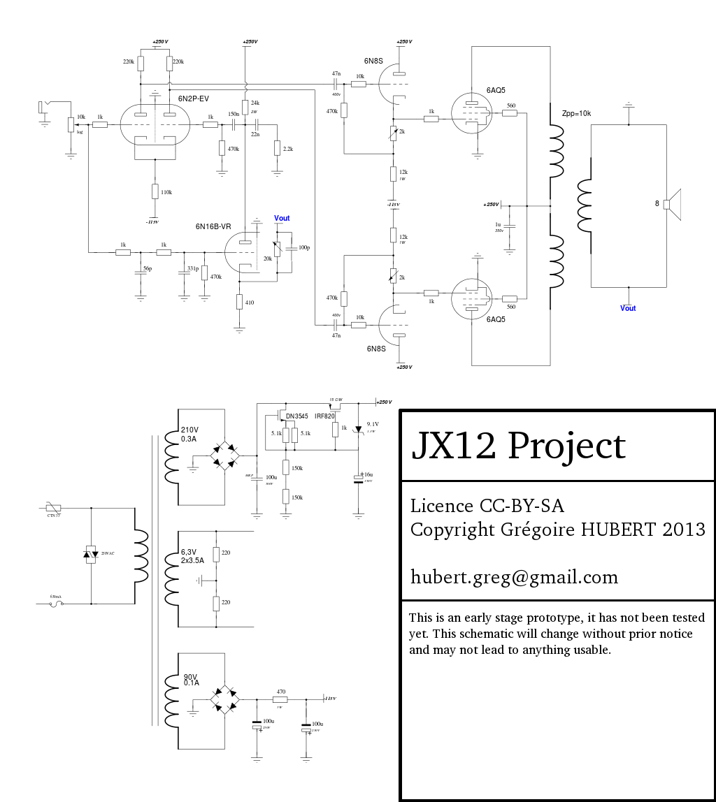

# JX12 Project

JX12 was a secret audio project, this is why it has such stupid name.

## What is this secret audio project ?

This work is based on an original idea from Arnaud Heagele on [René Conseil's forum](http://6bm8-lab.fr/phpBB/viewtopic.php?f=3&t=170 [6B8M]). This comes from a [Bell Lab patent](http://www.google.fr/patents?id=lTN8AAAAEBAJ&pg=PA2&hl=fr&source=gbs_selected_pages&cad=4#v=onepage&q&f=false [original patent description]) in the 70s.

This is a very standard valve push pull amplifier using very common (and cheap) tubes. Instead of using a normal negative feedback it uses an extra valve to create a correction feedback. This particularity dramatically lowers the output impedance to levels rarely seen with valve amplifiers while not decreasing the gain. According Arnaud's experimentations, the output damping factor equals approximately the amplification factor of the correction stage. In this case, the 6N16B valve gives us an amplification factor of 20 which means a output impedance of 0,4Ω at 20Hz with 9,7W output power in 8Ω. Measured THD is -53dB (0.2%) at 1kHz sinus 1W in 8Ω.

## About the construction

### Power supply

The power supply is a critical part of this project and it deserves a lot of attention. Two parts do depend directly from the power supply :

 * The correction valve: any noise from the PSU will find itself on this valve's anode hence re-injected on the 6N2P (high gain) triode's grid with the input signal.
 * The cathode follower: it is auto-biased and it creates the polarisation for the power tubes. A 1V shift from the PSU will result on power tubes 1V bias shift.
 * The bandwidth of the amplifier is intentionally extended in the low frequencies to prevent motor-boating, the PSU must be able to handle low frequency response.

Since the power tubes are pentodes, they are pretty immunised to noise except on their g2 grid. For the sake of simplicity it has been chosen to use a simple regulated power supply. Several variants have been tested but semi-conductor is really sensitive to heat, this means no zener (unstable AND noisy) nor current diodes. The best choice is [Yves Monmagnon's regulated PSU](http://www.dissident-audio.com/RegulHT/Regul.html) which has been tested successfully to be reliable and stable in addition of being simple.

The proposed PSU is the first awkward attempt for this kind of amplifier. A complete redesign might be proposed for a version 2 using a choke.

### Correction

The correction filter is one of the main tweak of this schematic. As the correction triode subtracts the output to the input, it is important to be able to tune the constant part of the summation.  

    ΔV = A × ( ∂Vin - β.∂Vout )

Where

 * ΔV is the differential correction that is applied on the 6N2P non inverter tube's grid.
 * A is the amplification factor of the 6N16B anode loaded stage (A = 22 with 23.5kΩ load).
 * ∂Vin is the input signal variation taken from the volume potentiometer.
 * ∂Vout is the output signal sent to the speakers.
 * β is the ratio of the output signal put on the 6N16B's cathode trough the 20kΩ potentiometer and the cathode's 410Ω divider.

In a perfect amplifier, the β ratio should be tuned to get `∂Vin - β.∂Vout = k` with `k` constant. If k > 0, we create a reaction and increase the gain. If k < 0 we create a negative feedback. Since the output signal is taken from behind an output transformer, it is impossible to get `k` constant without filtering the input signal prior to the correction stage. Even if we manage to keep `k` very low under 0, the gain spikes of the OPT at the ends of its bandwidth will invariably create an oscillator.

To prevent this in the high frequencies, a double RC filter has been "designed" on the input signal. To ensure the correction gain to decrease as the frequency raises, a couple C + R has been set on the 6N16B's anode. There is the same problem at the very low frequencies. Although the output transformer's response at frequencies less than 1Hz are attenuated, since there is no signal at theses frequencies, any noise will be re-injected as a reaction through the correction, especially if the phase of this noise is shifted in the amplifier. This is why it is important to make the amplifier able to handle frequencies down to < 1Hz. 

This is not desirable in a conventional amplifier to prevent motor-boating effects and bad bass response. Here, the correction makes this to work properly as soon as the bass response arrives in phase with its correction. The `k` factor determined by the 20kΩ potentiometer must be tuned to ensure correction efficiency, with no reaction effect to prevent motor-boating. This can be done in a simple way :

 * Measure the output gain in an 8Ω load at 1kHz.
 * Plug the correction at 1kHz en ensure the gain _is the same_ using the 20kΩ pot.
 * Apply sharp signal amplitude variations (20dB switch) and check there is no low frequency parasitic oscillation forming.

