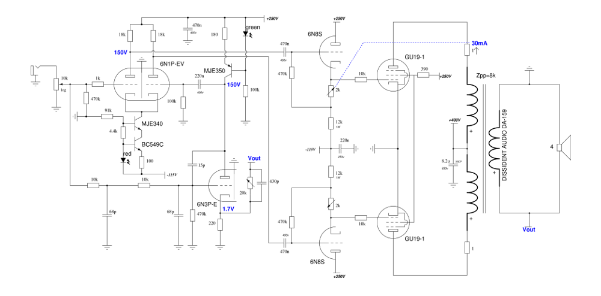

# JX12 Project

JX12 is a secret audio project, this is why it has such stupid name. 

## What is this secret audio project ?

This is a very standard valve push pull amplifier using very common (and cheap) tubes. Instead of using a normal negative feedback it uses an extra valve to create a correction positive feedback. This particularity dramatically lowers the output impedance to levels rarely seen with valve amplifiers (<1Ω). This work is based on an original idea from Arnaud Heagele on [René Cariou's forum](http://6bm8-lab.fr/phpBB/viewtopic.php?f=3&t=170 [6B8M]).

## About the construction

### Power supply

The power supply is a critical part of this project and it deserves a lot of attention. Two parts do depend directly from the power supply :

 * the correction valve: any noise from the PSU will find itself on this valve's anode hence re-injected on the 6N2P (high gain) triode's grid with the input signal.
 * the cathod follower: it is auto-biased and it creates the polarisation for the power tubes. A 1V shift from the PSU will result on power tubes 1V shift bias.

Since the power tubes are pentodes, they are pretty immuned to noise except on their g2 grid. For the sake of simplicity it has been choosen to use a simple regulated power supply. Several of them have been tested but silicium is really sensitive to heat, this means no zener (unstable AND noisy) nor current diodes. The next try will be [Yves Monmagnon's regulated PSU](http://www.dissident-audio.com/RegulHT/Regul.html) which has been tested successfully to be reliable and stable in addition of beeing simple.

